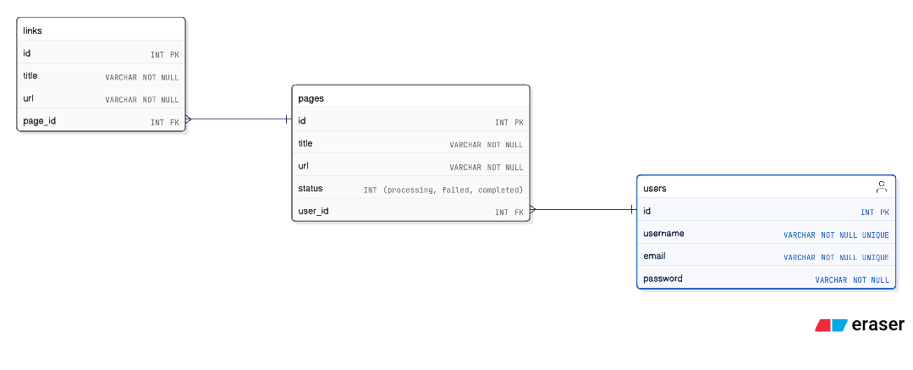

# Web Scraper Rails

App that allows users to scrape a web page and get a list of all of the links in that page.

## Tech Stack 

- Rails 7.2.2
- PostgreSQL

### Relational Model



### Libraries
- [Devise](https://github.com/heartcombo/devise) (Authentication)
- [TailwindCSS](https://tailwindcss.com/) (CSS Library)
- [Faraday](https://lostisland.github.io/faraday/#/) (Http Client)
- [Nokogiri](https://github.com/sparklemotion/nokogiri) (HTML parser)
- [Simplecov](https://github.com/colszowka/simplecov) (Display Code coverage)
- [Pagy](https://ddnexus.github.io/pagy/) (Pagination)

#### Testing
- [RSpec](https://rspec.info/) (Testing framework)
- [Factory bot](https://github.com/thoughtbot/factory_bot) (Mocked data models)
- [Faker](https://github.com/faker-ruby/faker) (Fake data for models)
- [VCR](https://github.com/vcr/vcr) (Record HTTP interactions)
- [Shoulda Matchers](https://matchers.shoulda.io/) (Simple One-liner for tests)

## NOTE: Correction of question asked during interview

- Question asked: **"What is the difference between `after_create` and `after_save` callbacks in ActiveRecord?"**
    - My answer was: `after_create` is executed after an object instance is created in memory (***not necessarily persisted***), while `after_save` is executed after the object instance is persisted (created or updated in DB).
- Correction: I was wrong about `after_create` callback. It is executed after the model instance is only created in DB (**not when it's updated**). Callbacks are meant to be executed in ActiveRecord operations and creating a model instance using `new` doesn't trigger callbacks.


## Local Dev Setup

### 1. Environment variables

Copy the [`.env.erb`](./.env.erb) content and create the `.env` file in the root of the project folder structure

```bash
cp .env.erb .env
```

> [!NOTE]
> Make sure you modify the `<password>` placeholder in `DATABASE_URL` with your own database password.
   

### 2. Set up `master.key`
Use the following command to create the `master.key` file with the default secret key given by `rails new`:

```bash
echo "49781a401c3063bb7858fd0b4e4aba13" > config/master.key
```

> [!NOTE]
> This is done for the sake of simplicity. In a production environment, you should ask the team for the `master.key`.

### 3. Database

1. Create the database

```bash
rails db:create
```

2. Load database schema into the database

```bash
rails db:schema:load
```

### 4. Run the app
If you want to use the TailwindCSS dev server to generate the CSS rules, run the following command:

```bash
bin/dev
```

Otherwhise, you can run the following command:

```bash
bin/rails server
```

The app will be available at `http://localhost:3000`


## Testing

To run the tests, use the following command:

```bash
bundle exec rspec
```

You will see the test coverage in the console and a HTML report in the `coverage` folder.